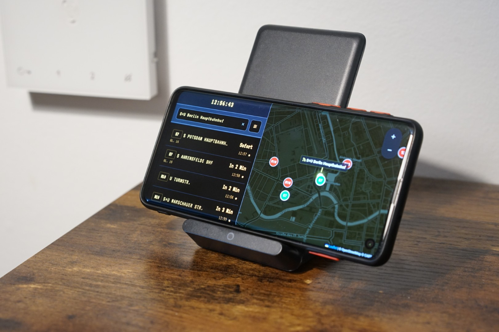
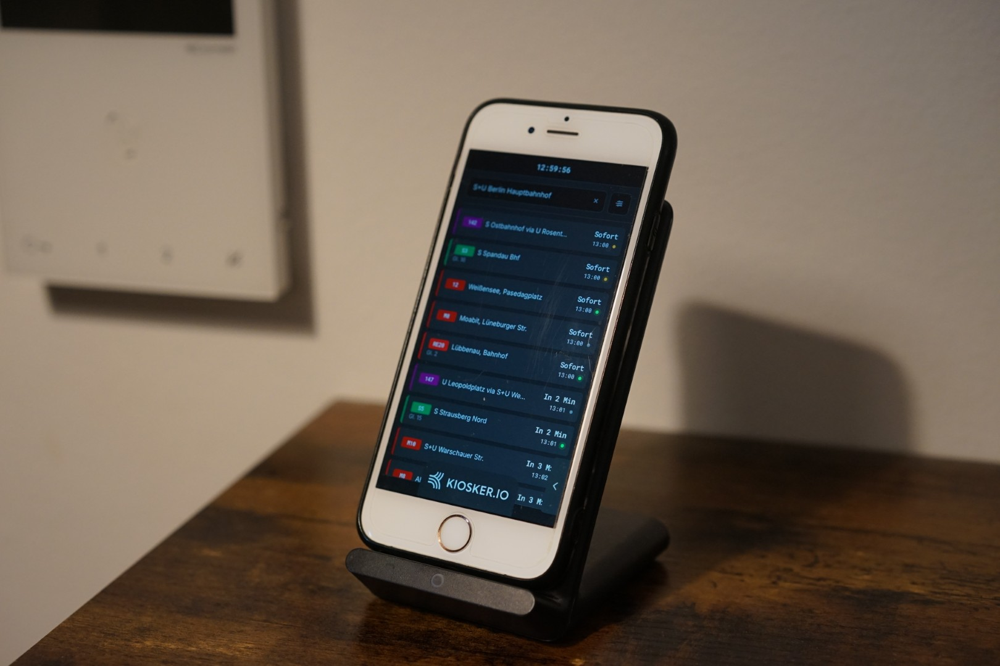

<iframe src="bvgtracker.html"
        class="w-full h-[520px] my-6 rounded-xl border border-gray-200 shadow-sm"
        loading="lazy" allowfullscreen></iframe>

A modern, responsive web dashboard designed for real-time monitoring of public transport departures in Berlin. This tool provides a comprehensive view of transit movements, combining temporal schedules with spatial tracking.

The page works on both desktop and mobile browsers and automatically updates
vehicle positions every few seconds.

This project was specifically designed and optimized to turn any spare smartphone or tablet into a dedicated, real-time smart transit monitor. By opening this dashboard in full-screen on an old device, you can create a permanent public transport timetable for your home, hallway, or office. 

<table align="center" style="border: none; background: none;">
  <tr style="border: none; background: none;">
    <td align="center" width="50%" style="border: none;">
      
       
      <i>1. Old Android phone displaying the timetable and real-time map (via the <b>Fully Kiosk Browser</b> app).</i>
    </td>
    <td align="center" width="50%" style="border: none;">
      
       
      <i>2. Old iPhone displaying the departure timetable (via the <b>Kiosker</b> app).</i>
    </td>
  </tr>
</table>
---

### 🔗 Data Source

Powered by **transport.rest**  
API documentation: https://v6.transport.rest/
Git Repo: https://github.com/iwaszm/BerlinStationMonitor

---

