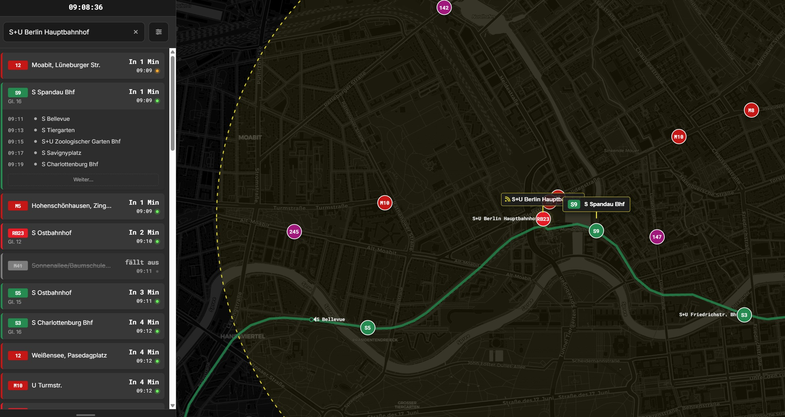
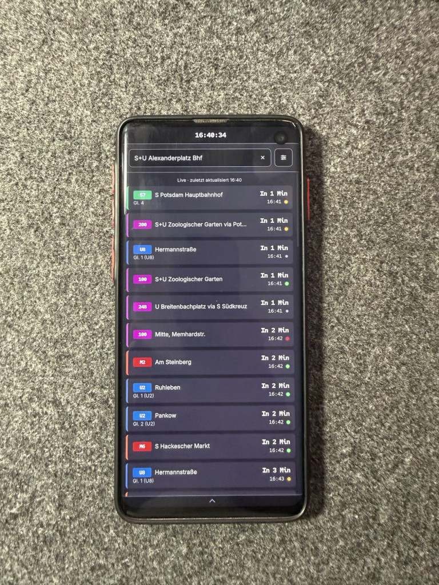

<iframe src="https://bsm.zhangmeng43.com/"
        class="w-full h-[520px] my-6 rounded-xl border border-gray-200 shadow-sm"
        loading="lazy" allowfullscreen></iframe>

A modern, responsive web dashboard designed for real-time monitoring of public transport departures in Berlin. This tool provides a comprehensive view of transit movements, combining temporal schedules with spatial tracking. The page works on both desktop and mobile browsers and automatically updates vehicle positions every few seconds.

<figure class="figure-container">
  
  
  <figcaption class="figure-caption">
    Figure 1. Dashboard on desktop browser.
  </figcaption>
</figure>

This project was specifically designed and optimized to turn any spare smartphone or tablet into a dedicated, real-time smart transit monitor. By opening this dashboard in full-screen on an old device, you can create a permanent public transport timetable for your home, hallway, or office. 

  <figure>
    
    <figcaption>Figure 2. Android phone displaying the departure timetable via Fully Kiosk Browser.</figcaption>
  </figure>
  <figure>
    
    <figcaption>Figure 3. Kindle displaying the departure timetable.</figcaption>
  </figure>

---

### 🔗 Data Source

Powered by **transport.rest**  
API documentation: https://v6.transport.rest/
Git Repo: https://github.com/iwaszm/BerlinStationMonitor

---

