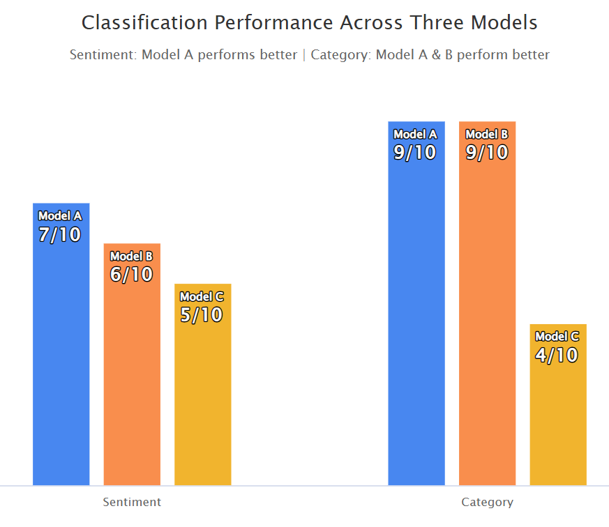

### Summary

This demo explores the use of _Hugging Face zero-shot text classification models_ to analyze multilingual user comments (e.g., YouTube). Two classification dimensions are focused on:

- **Sentiment**: whether the comment is positive, neutral, or negative  
- **Category**: what the comment refers to (functionality, UI, or ads)

---

### Selected Models
Three pre-trained NLI-based transformer models are used for comparison:

- Model A: `facebook/bart-large-mnli`  
- Model B: `joeddav/xlm-roberta-large-xnli`  
- Model C: `typeform/distilbert-base-uncased-mnli`

---

### Classification
Following are 10 manually labeled comments, spanning multiple languages, sentiment types, and categories. Each model classifies each comment for both sentiment and category, correct results are shown in **bold** in the table below.

| Comment                                                                 |      Sentiment      |               |               |      Category       |               |               |
|------------------------------------------------------------------------|---------------------|---------------|---------------|---------------------|---------------|---------------|
|                                                                        | A                   | B             | C             | A                   | B             | C             |
| The video loads fast and never lags. Love it!                          | **positive**        | **positive**  | **positive**  | **functionality**   | **functionality** | **functionality** |
| The search function works fine, but nothing special.                   | **neutral**         | positive      | positive      | **functionality**   | **functionality** | user interface |
| I can’t rewind properly anymore, super annoying.                       | **negative**        | **negative**  | **negative**  | **functionality**   | **functionality** | **functionality** |
| I like how the app looks now, clean and smooth.                        | **positive**        | **positive**  | **positive**  | **user interface**  | **user interface** | functionality  |
| I am ok with the UI, it can be better though.                          | positive            | positive      | positive      | **user interface**  | **user interface** | functionality  |
| The layout is messy after the latest update.                           | **negative**        | **negative**  | **negative**  | **user interface**  | **user interface** | functionality  |
| Way too many ads these days, it ruins the experience.                 | **negative**        | **negative**  | **negative**  | **ads**             | **ads**       | **ads**       |
| Ads are skippable now, so it’s not too bad.                            | positive            | positive      | positive      | **ads**             | functionality | **ads**       |
| DE: Zu viele nervige Werbungen, es macht keinen Spaß mehr.                | **negative**        | **negative**  | positive      | **ads**             | **ads**       | functionality |
| CN: 功能正常，但感觉有点卡。                                                   | positive            | positive      | positive      | user interface  | **functionality** | user interface |

### Performance

### Next Steps

  App Store and Google Play both provide public access to app reviews. 
  By identifying the corresponding app ID (for example, YouTube’s App Store ID is 544007664), 
  these review data can be extracted automatically. Combined with the comment classification 
  method demonstrated above, this enables real-time categorization of user feedback and helps 
  track emerging user needs and pain points.

