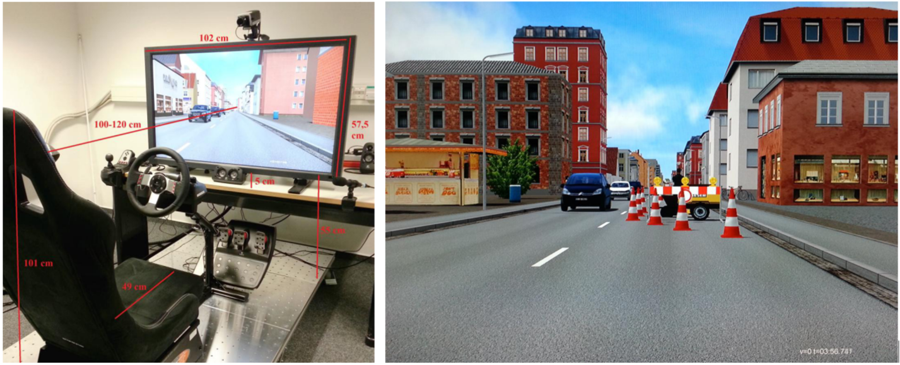
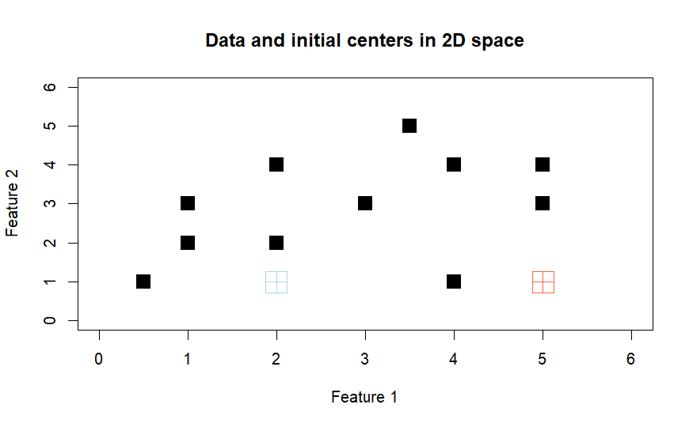

### How can emotions be quantified?

To describe facial expressions systematically, Paul Ekman and his colleagues developed the _Facial Action Coding System (FACS)_ [^1]. This system groups visible facial muscle movements and certain head motions into identifiable units called _Action Units (AUs)_. Each AU represents a specific facial muscle activity that can be observed and coded manually or by software.

[^1]: Ekman, P. Friesen, W. V. & Hager, J. C. (2002). Manual for the facial action coding system. Salt Lake City: A Human Face.

The table below shows a selection of AUs along with their descriptions and how accurately they were detected by facial recognition software I used in 2016.

| Action Unit | Description                     | Accuracy | N   |
|-------------|---------------------------------|----------|-----|
| 1           | Raise inner eyebrow             | 89.7 %   | 175 |
| 2           | Raise outer eyebrow             | 88.9 %   | 117 |
| 4           | Lower brows                     | 94.3 %   | 194 |
| 5           | Raise upper eyelids             | 95.1 %   | 102 |
| 6           | Raise cheeks                    | 92.7 %   | 123 |
| 7           | Tighten eyelids                 | 93.4 %   | 121 |
| 9           | Wrinkle nose                    | 100 %    | 75  |
| 10          | Raise upper lip                 | 90.5 %   | 21  |
| 12          | Pull lip corners (smile)        | 95.4 %   | 131 |
| 14          | Dimpler                         | 67.6 %   | 37  |
| 15          | Depress lip corners             | 89.4 %   | 94  |
| 17          | Raise chin                      | 86.6 %   | 202 |
| 18          | Pucker lips                     | 88.9 %   | 9   |
| 20          | Stretch lips                    | 92.4 %   | 79  |
| 23          | Tighten lips                    | 63.3 %   | 60  |
| 24          | Press lips together             | 65.5 %   | 58  |
| 25          | Open mouth                      | 76.9 %   | 324 |
| 26          | Drop jaw                        | 48 %     | 50  |
| 28          | Suck in lips                    | 100 %    | 1   |

Although there are some individual differences, it is generally assumed that specific facial expressions are universally associated with certain emotions, across people and cultures. The diagram below illustrates how specific combinations of Action Units (AUs) form the prototypical expressions of basic emotions like fear, joy, sadness, and anger[^2].

[^2]: Ekman, P. & Friesen, W. V. (1978). Manual for the facial action coding system. Palo Alto: Consulting Psychologists Press.

<iframe src="AU.html"
        class="w-full h-[520px] my-6 rounded-xl border border-gray-200 shadow-sm"
        loading="lazy" allowfullscreen></iframe>

### How can we read a driver's face?
The Facial Action Coding System (FACS) offers a systematic way to describe facial muscle movements, and that means we can leverage it to assess driver emotions. But here’s the question:  

**Which facial muscle movements are linked to frustration during driving?**

**30 participants** were invited to take part in a simulated driving experiment. Each driver faced two contrasting traffic scenarios:

🚗 **Smooth traffic**  
🚗 **Traffic jam**

To enhance immersion, participants were rewarded for reaching their destination within a set time limit: making delays feel more frustrating and emotionally charged. The image below shows the driving simulator setup and one such frustrating moment, captured inside our virtual traffic jam:

Statistical results revealed that several facial muscle movements (Action Units, AUs) appeared **significantly more often during traffic jam** than in smooth ones. These frustration-linked AUs include:

- **AU2**: Raise outer eyebrows  
- **AU5**: Raise upper eyelids  
- **AU6**: Raise cheeks  
- **AU9**: Wrinkle nose  
- **AU10**: Raise upper lip  
- **AU12**: Pull lip corners (smile)  
- **AU14**: Dimpler  
- **AU15**: Depress lip corners  
- **AU17**: Raise chin  
- **AU18**: Pucker lips  
- **AU23**: Tighten lips  
- **AU28**: Suck in lips

### What is a frustrated facial expression?

While individual Action Units (AUs) are meaningful, facial expressions are usually combinations of multiple AUs. In fact, the AUs that appeared more frequently during traffic jams may not act alone. They likely combine to form **complex expressions**. To uncover these hidden combinations, I conducted a **clustering analysis** on the facial data observed during the jam condition. **K-Means Clustering** was employed. The core idea is simple: group similar data points based on how close they are in space.

The K-Means process works in following steps:
1. Randomly choose initial cluster centers.
2. Assign each observation to the nearest cluster center.
3. Update the cluster centers based on the new groupings.
4. This cycle repeats until stable clusters emerge.

<iframe src="cluster.html"
        class="w-full h-[520px] my-6 rounded-xl border border-gray-200 shadow-sm"
        loading="lazy" allowfullscreen></iframe>

Facial expression data were grouped into **five clusters** using K-Means clustering. Each cluster represents a common combination of Action Units (AUs), potentially reflecting a distinct emotional pattern. The **radar chart** below shows the *average activation level* (cluster centers) for each AU across the five clusters.

**Cluster 4** was the **only one that appeared significantly more often** during traffic jams than in smooth driving.

Cluster 4 is mainly defined by the co-activation of:

- **AU 9** – *Wrinkle nose*  
- **AU 18** – *Pucker lips*  
- **AU 24** – *Press lips together*

This particular combination may represent the **facial expression of frustration** in the driving context.

### What does a "frustrated face" look like?

[back to top](#top)

