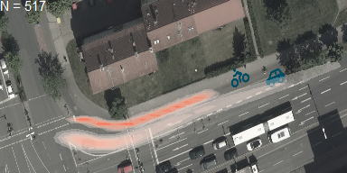

### Introduction

The study, using real-world data, aims to model the interaction between **crossing bicycles** and **right-turning vehicles**, attempting to alter the simulator's guidance at the tactical level. In ten days of video recordings from an urban intersection, **517 valid cases** were collected.

<figure class="my-6 text-center">
  
  <figcaption class="mt-2 text-sm text-gray-600">
    Figure 1. Trajectories of crossing bicycles and right-turning vehicles.
  </figcaption>
</figure>

---

### Modeling

A **logistic regression model** of crossing order was employed with features of bicycles (0) and vehicles (1):  
- speed (*v*)
- speed difference (*dv*)
- distance to crossing point (*d2x*)
- predicted PET (*ppet*).  

The dataset was split into **training (80%)** and **testing (20%)** subsets. Models with different feature combinations were cross-validated.

$$
\log\left(\frac{p}{1-p}\right)
= \beta_0 + \beta_1 x_1 + \beta_2 x_2 + \ldots + \beta_k x_k
$$

<iframe src="highchart1.html"
        class="w-full h-[520px] my-6 rounded-xl border border-gray-200 shadow-sm"
        loading="lazy" allowfullscreen></iframe>

---

### Simulation

The selected model was implemented in **SUMO**: At 20 m before the crossing point, the crossing order was estimated, and the lagging object was forced to slow down. A comparison was performed between **real data**, **SUMO’s default model**, and **this new model**.

- In reality, **74%** of bicycles crossed before vehicles.  
- In the default model, vehicles were more conservative - bicycles crossed first in about 90% of cases.  
- The new model brings this ratio **closer to 50%**, though still not identical to real data.  
- In the default model, **PET distributions** vary strongly by crossing order, whereas in the real-world data and new model, PET distributions are similar (yet differ by ~1 s).

<iframe src="highchart2.html"
        class="w-full h-[520px] my-6 rounded-xl border border-gray-200 shadow-sm"
        loading="lazy" allowfullscreen></iframe>

---

### Conclusion

The study of **interactions between bicycles and vehicles** in real traffic contributes to improving **simulator realism**.  
Although the new model did not perfectly reproduce the crossing-order distribution, it significantly improved the **PET distribution**, bringing it closer to reality.

